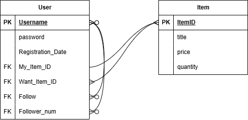

# :guardsman: 우리를 위한 중고거래 :: SpartaMarket :carrot:
Sparta Ch4. Django project

---

## :guardsman:프로젝트 소개
우리를 위한 중고거래 :: SpartaMarket(이하 SpartaMarket)은 사용자가 온라인 상에서 쉽고 빠르게 중고물품 거래를 가능하게 하는 웹 서비스입니다. 

## :trophy:프로젝트 핵심 목표
Django 등을 사용해 회원들이 쉽게 중고거래를 할 수 있게 하는 웹 애플리케이션의 웹 기능 구현
ERD를 작성하고 데이터베이스의 모델을 설계하는 연습

## :star2:주요 기능
- 회원기능: 
  - 회원가입, 로그인, 로그아웃
- 유저기능: 프로필 페이지 구현
  - username, 가입일, 내가 등록한 물품 확인
  - 내가 찜한 물건들의 목록 확인
  - ~~Follow 기능~~
- 게시 기능: 
  - 물건의 목록, 개별 물건 디테일 페이지
  - 게시물 등록, 조회, 수정, 삭제 기능
  - 찜하기 기능

구매 기능과 지역별 기능은 구현되지 않았다. 

---

## :file_folder:Entity Relationship Diagram

user - 계정 관련된 기능을 다루는 개체, 실제 이름은 accounts이다.

User 속성

- Username: 계정명
- password: 계정의 비밀번호
- My_item_ID: 자신이 등록한 게시물(물품)의 ID
- Want_item_ID: 자신이 찜한 게시물(물품)의 ID
- Follow: 자신이 팔로우한 계정의 username
- Follower_num: 자신이 팔로우한 계정의 수, 초기엔 따로 다룰 예정이었으나 팔로우하는 계정의 개수를 return하려다 개발이 중단되었다. 

 
 

Item(products) - 상품 관련된 기능을 다루는 개체, 실제 이름은 articles로 되어있다. 

Item 속성 

- ItemID: 게시물의 식별용 ID, username과 달리 게시물은 제목으로 식별하지 않고 해당 속성으로 식별한다. 
- price: 물품의 가격, 실제로 구현이 되지 않았고 작성자가 직접 게시글의 내용에 가격을 적는 형태로 구현
- quantity: 물품의 갯수, 실제로 구현되지 않고 작성자가 직접 게시글의 내용에 가격을 적게 변경

### :open_file_folder:프로젝트에 포함된 App
#### Accounts
기본적인 회원 기능과 유저별 프로필 페이지 및 그와 관련된 기능들이 포함되어 있다. 

templates 

- mypage.html - 유저별 프로필 페이지
- signup.html - 회원가입 페이지
- login.html - 유저 로그인 페이지
- update.html - 유저 프로필 정보 변경 페이지
- change_password.html - 유저 비밀번호 변경 페이지

 views 

- login - POST request를 받아 로그인, 그외의 requst method엔 유저를 로그인 페이지로 이동
- logout - POST request를 받아 로그아웃
- signup - POST request를 받아 auth_user에 새 계정 생성, 그외엔 유저를 회원가입 페이지로 이동
- delete - POST request를 받아 계정을 auth_user에서 삭제
- update - POST request를 받아 유저 프로필 정보 변경 페이지, GET request를 받아 프로필 정보 변경 페이지로 이동 
- mypage - 프로필 페이지로 이동
- change_password - POST request를 받아 비밀번호 변경, 그외엔 비밀번호 변경 페이지로 이동

#### Articles
물건 목록 페이지와 개별 물건의 디테일 페이지, 그리고 그와 관련된 게시, 삭제, 수정 등의 기능이 포함되어 있다, 

templates 

- article_detail.html - 개별 물품의 디테일 페이지
- articles.html - 물건 목록 페이지
- edit.html - 게시글 수정 페이지
- new.html - 새 게시글 작성 페이지

 views 

- articles - 유저를 물건 목록 페이지로 이동, 각 게시글은 articles_article에 저장되어 있다. 
- new - 새 게시글 작성 페이지로 이동, 로그인이 되어있지 않다면 로그인 페이지로 이동
- create - POST request를 받아 new에서 작성한 글을 articles_article 테이블에 추가, 해당 글 디테일 페이지로 리다이렉트
POST request가 아닐 경우 새 글 생성 페이지로 리다이렉트
- article_detail - 게시글의 디테일 페이지로 이동
- delete - POST request를 받아 게시글을 articles_article에서 삭제
- edit - 게시글 편집, 로그인이 안되어 있다면 로그인 페이지로 이동
- update - edit에서 편집된 글을 articles_article에 등록, 해당 글 디테일 페이지로 리다이렉트, 로그인이 안되어 있다면 로그인 페이지로 이동 
- toggle_like - 자신의 찜 목록에 추가 / 삭제, 로그인 필요

## :mag_right:성과 및 회고
Django를 이용해 데이터베이스 모델을 설계 및 구현해보는데 의의를 두었다. 해당 프로젝트를 진행하면서 django를 이용해 웹 서비스를 개발하는 과정과 연관된 경험을 쌓을 수 있었다. 
예정되었던 기능 중 팔로우 기능은 추가하려면 기존의 accounts 모델을 포기하고 새로운 모델을 제작해 기존 모델을 대체해야 하는데 남은 시간으로는 불가능하다고 판단해 포기하게 되었다. 
향후 포기했던 팔로우 기능과 UI작업, 이미지 등의 멀티미디어 기능, 게시물의 찜수 / 조회수 확인 기능과 해시태그 기능, 검색 기능 등에 추가 작업을 진행할 계획이 있다. 